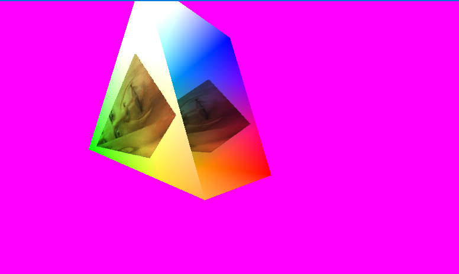

# OpenGL test

### In-App Features
- Capturing mouse (lclick) for camera control (esc releases)
- Camera rotation (QE)
- Movement (WASD, space, lshift) - doesnt orbit relative to looking direction

### Internal Features
- Loading OGL
- An advanced input system (incomplete)
- Shading geometry
- Loading images

### As a learning resource
Feel free to experiment and do what you want with this project.
Note that comments are sparse, so it may be hard to follow along without the OGL documentation / a guide open.
I can't remember my learning process exactly when starting this project, it may be derived from some other work. Sorry.

### Building
- When building, build `OPGL`
- If you wish to change the libraries with versions, make sure to update the cmake file
- Check the `releases` tab for the libraries I used when building the project.
